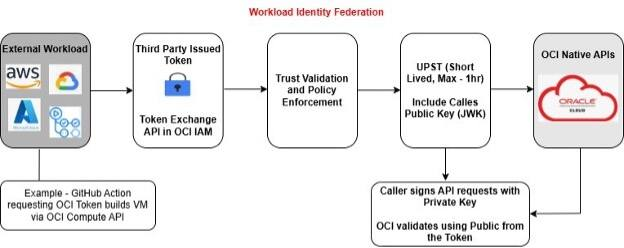
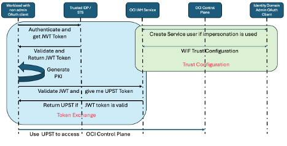

# OCI Workload Identity Federation 

To make Multi Cloud easy, Oracle released a new feature this month. Workload Identity Federation enables access to Oracle cloud resources without storing static credentials. It can be used to access (use, provision, or manage) OCI resources from GitLab CI/CD, GitHub Action, or from any other CSP.

Any OCI API requires a valid service token. If you run workload or OCI Infrastructure as Code (IaC) (aka. Terraform script) on OCI instance, then you can use OCI instance principal to invoke OCI API. However, suppose the workload or IaC script is running outside of OCI. In that case, you must use static credentials (API key) to generate a User Principal Service Token (UPST) and invoke the OCI API. To avoid using static credentials, Oracle has implemented Workload Identity Federation (WIF). Using WIF, you can configure OCI IAM to trust external Identity Provider (IDP) JWT tokens. Once the trust relationship is established, you can exchange the IDP JWT token for an OCI UPST. OCI UPST can be used to invoke OCI APIs. UPST tokens, also known as temporary tokens, are valid for 60 minutes.



# Workload Identity Federation Workflow

Workload Identity Federation requires one time setup (trust configuration setup) using IAM domain Administrator. Once the setup is done, the workload can exchange IDP JWT tokens for OCI UPST tokens.



You can read more information from 

# Sample Code

This is Python code to automate Workload Identity Federation setup and testing token exchange API. As you can see in the workflow, WIF requires setup from Identity Domain Administrator. Once the setup is done, WIF runtime is using the WIF setup to exchange IDP (Identity Provider) token for OCI UPST. 

* wifSetup.py is used to setup WIF with the IDP. setupConfig.ini file has the configuration that is required for WIF setup. The setup script will add token exchange OAuth client credentials to the runtimeConfig.ini file.
* wifRuntime.py is used to test the setup and exchange IDP token for OCI UPST token. The runtime script will create private_key.pem file that is requried to use UPST token and invoke OCI control plane APIs. The runtime script will also create upstToken file that has the UPST token. You are required to use both the token file and private key when you want to use them and invoke OCI control plane APIs. 
* upstTokenExample.py is the sample python code to use UPST and private key to invoke OCI control plane APIs. 

## Prerequisites

- Python 3.x installed
- [OCI CLI](https://docs.oracle.com/en-us/iaas/Content/API/SDKDocs/cliinstall.htm) installed and configured
- OCI Python SDK installed (`pip install oci`)

## Files

- `wifSetup.py`: Automates the setup for Workload Identity Federation.
- `wifRuntime.py`: Uses WIF setup to exchange IDP JWT token for OCI UPST token.
- `setupConfig.ini`: Configuration file for WIF setup.
- `runtimeConfig.ini`: Configuration file for token exchange runtime.
- `upstTokenExample.py`: Uses UPST token and private key generated from wifRuntime to perform OCI operation. 

## Usage

1. **Configure OCI CLI**  
    Ensure you have a valid OCI CLI profile.

2. **Install dependencies**  
    ```bash
    pip install oci
    ```

3. **Run setup**  
    Make sure to update WIF setup configuration in setupConfig.ini.
    ```bash
    python wifSetup.py
    ```

4. **Test token exchange**  
    Make sure to update WIF Runtime configuration in runtimeConfig.ini. That includes generating IDP JWT token and adding the token in the configuration file. 
    ```bash
    python wifRuntime.py

5. **Test UPST Token**
    ```bash
    python upstTokenExample.py
    ```

## Notes

Terraform folder has terraform sample to use UPST token and private key that are generated from wifRuntime.py script. 

